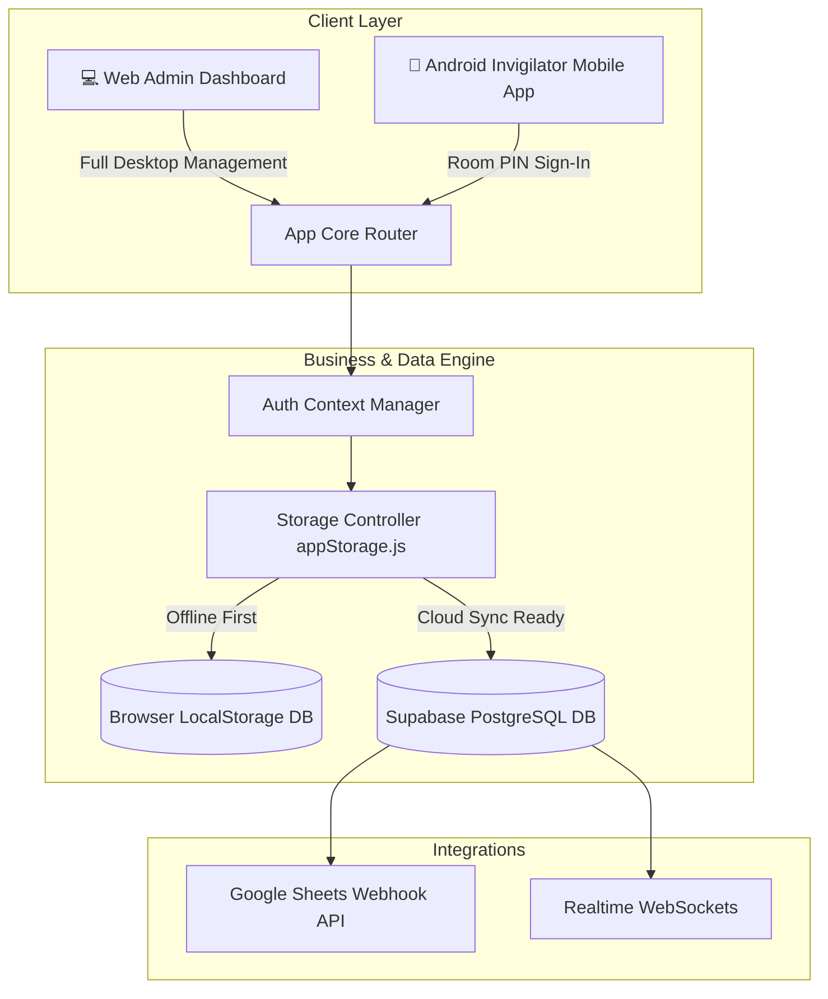
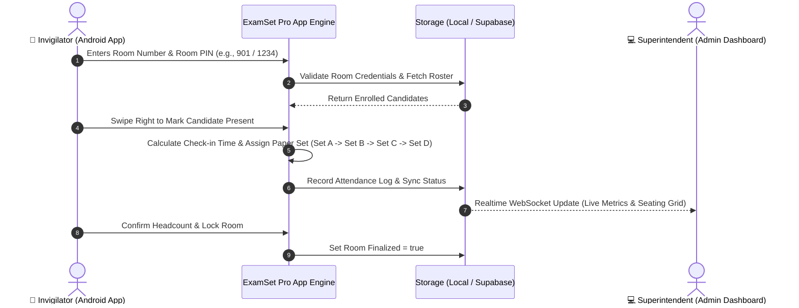

# 🎓 ExamSet Pro (TGLSETX-allocator)

> **Real-Time Examination Attendance Verification & Chronological Paper Set Allocator**

ExamSet Pro is an enterprise-grade examination management system designed to streamline candidate attendance verification, automate chronological question paper set distribution, prevent malpractice, and provide real-time monitoring for Chief Exam Superintendents and Hall Invigilators.

---

## 📐 System Architecture



### 🔄 Data Flow & Chronological Set Allocation



---

## 🌟 Key Features & Dual-Persona Interface

### 💻 1. Chief Superintendent (Admin Web App)
- **Live Attendance Command Center**: Monitor real-time candidate verification across all examination halls with instant metric counters (Enrolled, Present, Gate-Late, Absent).
- **Excel Seating Master Ingestion**: Drag-and-drop `.xlsx` master seating files to automatically initialize exams, room layouts, and candidate rosters.
- **Attendance Calendar & History**: Track examination schedules, activate upcoming exam slots, and review historical hall statistics.
- **Student Directory**: Cross-room search engine to trace candidates across any hall.
- **Audit Logs & Export**: Full chronological activity audit log and export to Excel/CSV or Google Sheets live webhooks.

### 📱 2. Invigilator Mobile Experience (Android Native App Concept)
- **Ergonomic Mobile Shell**: Built specifically for mobile phones with simulated Android status indicators (`5G • 🟢 Sync Ready`), compact header, and thumb-friendly touch targets.
- **Room PIN Authentication**: Fast 3-step sign-in using Hall Number + 4-digit PIN.
- **Interactive Swipe Roster**:
  - **Swipe Right**: Mark Candidate Present (auto-assigns chronological paper set + records timestamp).
  - **Swipe Left**: Undo / Mark Absent.
- **Room PIN & Headcount Progress Card**: Shows live verification progress bar (`80% Verified`) alongside the current Room PIN .
- **Android Material Finalization Dialog**: Custom touch modal to verify physical head count and lock room attendance.
- **Numeric Dialpad Drawer**: Built-in dialpad for rapid roll-number searches during peak check-in.

---

## 📂 Repository Structure

```
TGLSETX-allocator/
├── public/                 # Favicons and SVG icon sprites
├── src/
│   ├── components/         # Reusable UI & Layout Components
│   │   ├── AdminLayout.jsx            # Desktop Web Admin Navigation Shell
│   │   ├── ConfirmationModal.jsx      # Animated Toast Notifications
│   │   ├── GoogleSheetSetupModal.jsx  # Live Webhook Integrations
│   │   ├── NumericKeypad.jsx          # Mobile Touch Keypad Drawer
│   │   └── StudentSwipeCard.jsx       # Gesture-based Attendance Card
│   ├── context/
│   │   └── AuthContext.jsx            # Global Authentication & Session Provider
│   ├── pages/
│   │   ├── Login.jsx                  # Dual-mode Sign-In Page (Room PIN / Admin)
│   │   ├── admin/                     # Chief Superintendent Pages
│   │   │   ├── LiveMonitoring.jsx
│   │   │   ├── AttendanceCalendar.jsx
│   │   │   ├── StudentDirectory.jsx
│   │   │   ├── DataIngestion.jsx
│   │   │   ├── ExamManager.jsx
│   │   │   ├── FacultyManager.jsx
│   │   │   └── AuditLogs.jsx
│   │   └── faculty/                   # Invigilator Mobile App Pages
│   │       └── FacultyAttendance.jsx  # Android Native Attendance Marking UI
│   ├── services/
│   │   ├── appStorage.js              # Offline-first Data Engine & Business Logic
│   │   └── supabaseClient.js          # Supabase Client Initialization
│   ├── App.jsx                        # Main Application Router & App Shells
│   ├── index.css                      # Global Styles & Animations
│   └── main.jsx                       # Application Entry Point
├── schema.sql              # Supabase PostgreSQL Database Schema & Realtime Setup
├── index.html              # HTML Shell
├── vite.config.js          # Vite Bundler Configuration
├── tailwind.config.js      # Tailwind CSS Configuration
└── package.json            # NPM Dependencies and Scripts
```

---

## ☁️ Database Setup (Supabase Integration)

ExamSet Pro works 100% offline out-of-the-box using `localStorage`. When you are ready to enable multi-device cloud synchronization or launch the Android Native App:

1. Create a project at [Supabase](https://supabase.com).
2. Open the **SQL Editor** in Supabase and paste the contents of [`schema.sql`](file:///c:/Users/nnand/Downloads/admin/schema.sql).
3. Run the SQL script to create the tables (`exams`, `rooms`, `students`, `attendance_logs`) and enable Realtime WebSockets.
4. Add your Supabase credentials to `.env.local`:
   ```env
   VITE_SUPABASE_URL=https://your-project.supabase.co
   VITE_SUPABASE_ANON_KEY=your-anon-key
   ```

---

## 📜 License
This project is licensed under the MIT License.
